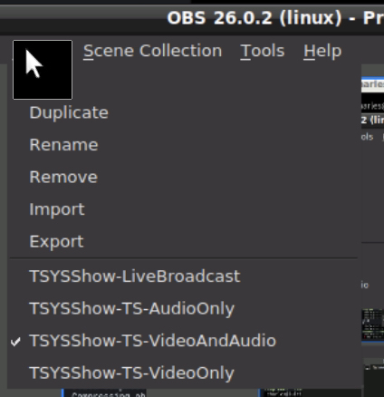

# PodcastAsAServiceStack

Client and server configs for TSYS Show Podcast pipeline. 

## Client setup

See the client directory for a shell script to automate obs startup/streaming (and if desired) local recording.

Requires setting up OBS. Here is how TSYSShow has it's OBS setup:

### Profiles

### Scenes

## Server setup
See the server directory for ngnix configuration and scripts to process flv output for output to youtube etc
