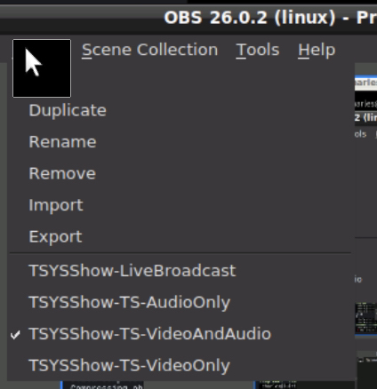
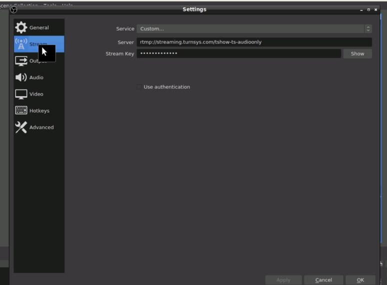
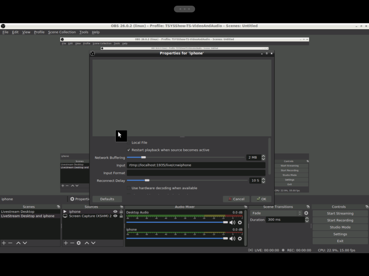
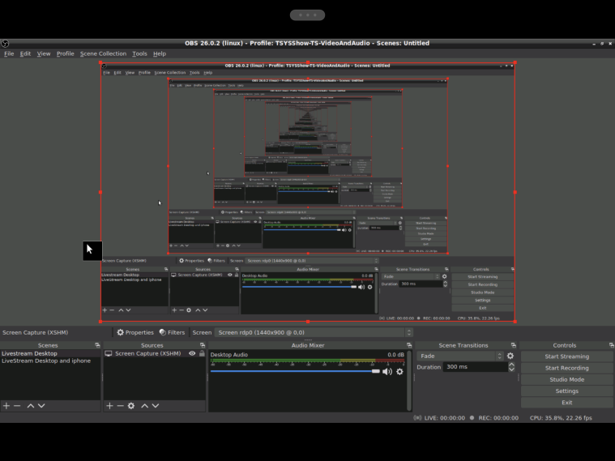

# PodcastAsAServiceStack

Client and server configs for TSYS Show Podcast pipeline. 

## Client setup

See the client directory for a shell script to automate obs startup/streaming (and if desired) local recording.

Requires setting up OBS. Here is how TSYSShow has it's OBS setup:

### Profiles

You need to setup any desired profiles in OBS one time, before using the scripts.
TSYS Show has setup some common ones (audio only, video only, live, audio/video):

Profiles contain your stream target settings.

### Scenes

You need to setup any desired scenes in OBS one time, before using the scripts.

 

 

## Server setup
See the server directory for ngnix configuration and scripts to process flv output for output to youtube etc

### Nginx setup

### Post process setup
